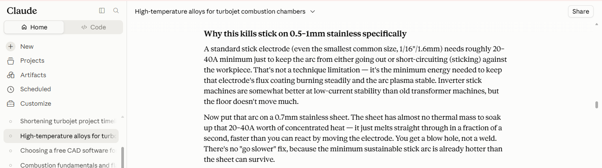

**What I did**: Decided on welding, materials for combustion chamber, and position of propane inlet\
**Decisions**:
+ I will weld the flanges onto the combustion chamber. First, I will weld the inner liner to the inside to the flange and the flange to the combustion chamber. Additionally, I will weld a flange onto the end of the chamber to fashion a flange joint on the turbine intake
+ The type of welding will be stick welding since I have a 50$ stick welding machine that fits within my budget
+ The base current needed to sustain stick welding, in most cases, is 20 to 40 amps, so I will use 2.5 mm steel since 0.5 - 1 mm steel with melt before I can get any welding done, due to the high current
+ The steel I will use is 304 stainless steel, as it is cheaper than other high performance alternatives (such as 321 and 316L), handles up to 870 Celsius, and is easier to source in Lebanon 
+ The combustion chamber air inlet will be in the side of the housing of the combustion chamber, which will help us achieve the toroidal circulation of hot gas (also know as a recirculation bubble) that makes sustained combustion possible
+ Propane inlet will be located in the center of the flange, which is mounted at the beginning of the combustion chamber, and that is because, at that position, the propane will be directly injected into the recirculation bubble and that directly helps us self-sustained combustion\
**What to do Next**: Find somewhere to buy the turbocharger from, and determine what instruments are needed for measuring the turbojet properties during test runs
